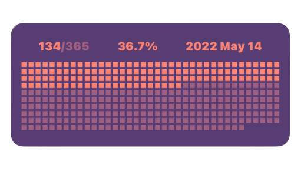
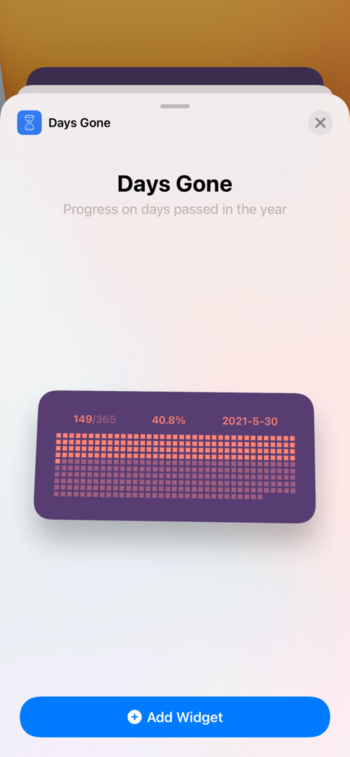
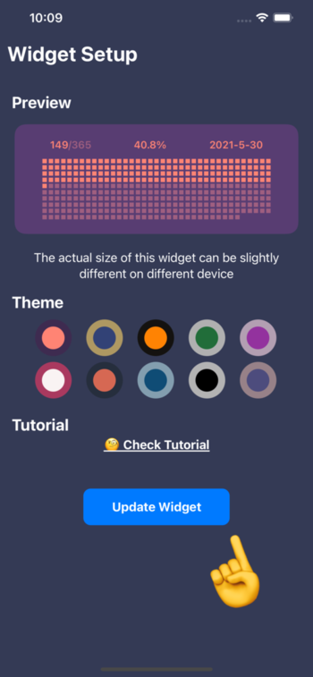
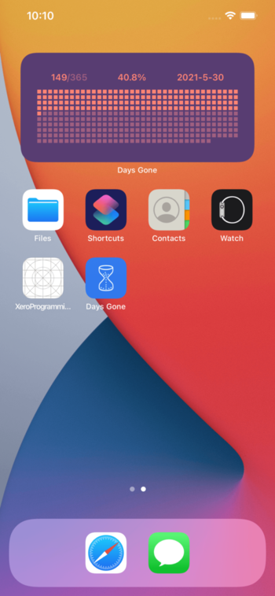

## Welcome to Days Tracker Widget (preivously named Days gone)

## 📱 What can it do
Adding a widget on your home screen on iPhone/iPad tracking the progress of the year. There are more than 10 themes you can choose from.

## 🛠 How to setup

### Step 0: Download the app from App Store
Of course we need to download the app first.

### Step 1: Add widget to screen
On the Home screen, long press any empty area until all the icons are shaking with a + button on the top left, tap the + button, and select Day Tracker (Days gone is the previous name)

### Step 2
Open the app, here we can make any update one the theme as we like, simply click the target theme circle you like, and tap the `Update Widget` button at the bottom. On the smaller screens you might find the button by scrolling down the screen a little bit.

### Step 3
🥳 That is all and Enjoy

### 📺 Screen recording tutorails

## 🎈 Download

## 📬 Support
Please create an issue above 👆 or just email me for support arkilis+daystracker@gmail.com